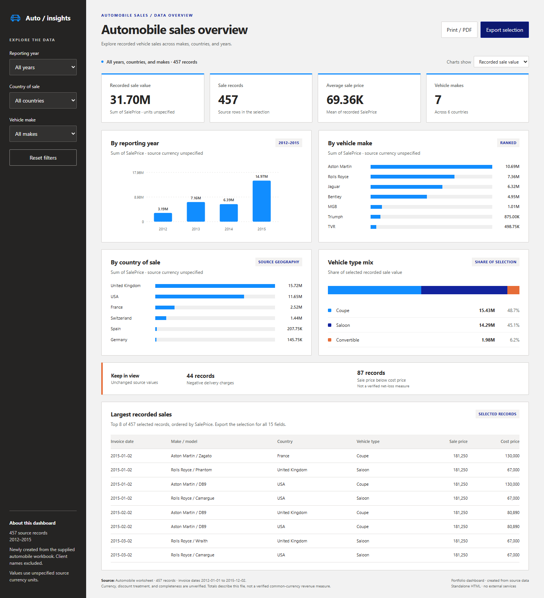

# Automobile Sales Dashboard

An interactive dashboard for exploring automobile sales by brand, country, reporting year, and vehicle type. It uses **457 records across 7 makes and 6 countries**, with invoice dates from **1 January 2012 to 2 December 2015**.

**[Interactive dashboard](dashboards/index.html)** · **[PDF snapshot](dashboards/exports/automobile-dashboard.pdf)** · **[Dataset](data/processed/automobile_sales.csv)**

Download `dashboards/index.html` using GitHub's **Download raw file** button, then open the file in a browser. It works offline with no installation or external services. GitHub displays HTML source rather than running the dashboard.



This dashboard was newly built from the supplied workbook during portfolio preparation. The original PDF named `Automobile Dashboard Analysis.pdf` contains unrelated retail visuals and is excluded. The new implementation uses HTML, CSS, and JavaScript; it is not a Power BI model or evidence that the assignment's DAX exercises were completed.

## Dashboard features

- Filter by reporting year, country, and vehicle make.
- Compare recorded sale value or record counts across years, makes, countries, and vehicle types.
- Inspect total and average recorded sale prices, record counts, and data-quality observations.
- View the eight largest selected sales and export all selected rows as CSV.
- Reset filters or print the current selection to PDF.

## Business questions

The supplied assignment brief asks how automobile sales vary across brands, countries, and time, and how the data could support inventory and sales decisions. The available fields support descriptive comparisons of recorded sale prices, makes, models, countries, and vehicle types.

The brief also asks about DAX, data preparation, and visual design. These are assignment requirements, not evidence that those tasks were completed. Budget, target, pipeline, region, and product-category fields are absent from the automobile workbook.

## Verified dataset summary

| Measure | Value |
| --- | ---: |
| Records | 457 |
| Makes / countries / vehicle types | 7 / 6 / 3 |
| Sum of recorded `SalePrice` | 31,697,940 |
| Average recorded `SalePrice` | 69,360.92 |
| Blank source cells | 0 |
| Exact duplicate source rows | 0 |

These figures were calculated from the supplied workbook. **Currency is unspecified**, and the relationship between `SalePrice` and `TotalDiscount` is undocumented. The sum is a source-data control total, not consolidated revenue in a verified common currency.

The audit also found **44 negative delivery charges** and **87 records with sale price below cost price**. Values are preserved and documented in [findings](reports/findings.md), rather than silently corrected.

## Documentation

- [Data provenance and export rules](data/README.md)
- [Data dictionary](docs/data_dictionary.md)
- [Methodology and metric definitions](docs/methodology.md)
- [Verified data findings](reports/findings.md)
- [Source inventory and audit](docs/source_audit.md)
- [Dashboard usage and build notes](dashboards/README.md)
- [Deploying on Vercel](docs/deployment.md)

## Reproduce and validate

The public CSV removes `ClientName`, retaining all 457 records and the other 15 fields. Dates are ISO-formatted, reporting fields are integers, and the six price/cost fields are numeric. Customer-level analysis is excluded.

Run the checks and rebuild the dashboard with Python 3.9 or later. Both scripts use only the standard library:

```sh
python scripts/validate_data.py
python scripts/build_dashboard.py
```

The validator reports source control totals and known anomalies. The builder embeds the CSV in a standalone HTML file. The dashboard and scripts are new work added during repository preparation. Browser checks verified the source cells, default and filtered totals, empty selections, reset, chart measure switching, CSV export, client-name exclusion, and mobile layout. The PDF was rendered and visually reviewed.

## Repository layout

```text
data/
  processed/automobile_sales.csv
  README.md
docs/
  data_dictionary.md
  methodology.md
  source_audit.md
reports/
  findings.md
dashboards/
  index.html
  src/dashboard.html
  exports/automobile-dashboard.pdf
  screenshots/automobile-overview.png
  README.md
scripts/
  validate_data.py
  build_dashboard.py
LICENSE
```

## Attribution and limits

The original workbook and two PDFs were supplied for this project. The 17-page assignment brief is branded CoachX and is treated as reference material, not as an authored findings report. All original attachments are preserved outside the public repository. See the [source audit](docs/source_audit.md) for filenames, checksums, and publishing decisions.

The existing [MIT license](LICENSE) is retained unchanged. The supplied materials do not establish an original dataset publication URL or separate dataset license; no additional ownership or licensing claims are made for them.
